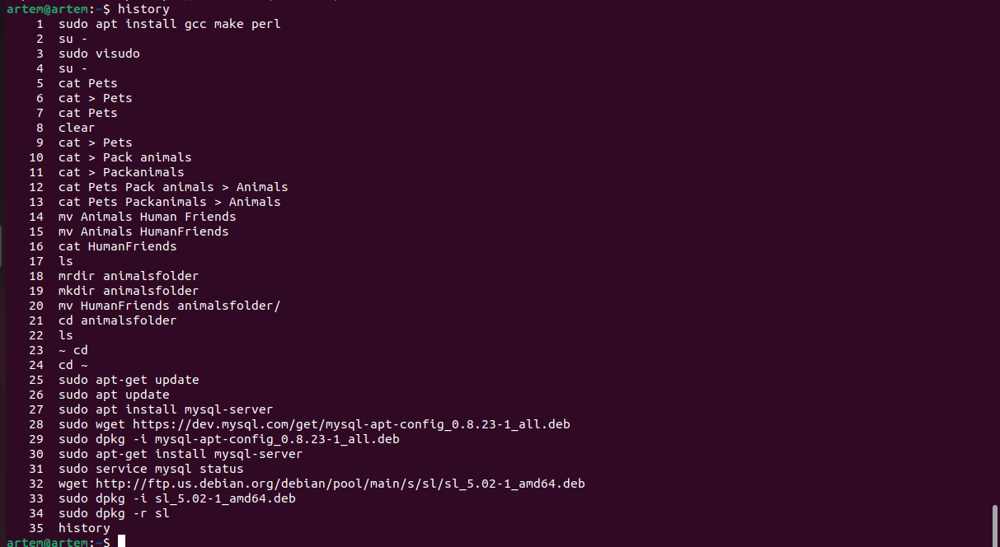

# Итоговая контрольная работа

 Информация о проекте
 Необходимо организовать систему учета для питомника в котором живут домашние и Pack animals. 

### Как сдавать проект 

Для сдачи проекта необходимо создать отдельный общедоступный репозиторий(Github, gitlub, или Bitbucket). Разработку вести в этом репозитории, использовать пул реквесты на изменения. Программа должна запускаться и работать, ошибок при выполнении программы быть не должно. Программа, может использоваться в различных системах, поэтому необходимо разработать класс в виде конструктора 

## Задание 

## Операционные системы и виртуализация (Linux)
1. Использование команды cat в Linux

   - Создать два текстовых файла: "Pets"(Домашние животные) и "Pack animals"(вьючные животные), используя команду `cat` в терминале Linux. В первом файле перечислить собак, кошек и хомяков. Во втором — лошадей, верблюдов и ослов.

   

   - Объединить содержимое этих двух файлов в один и просмотреть его содержимое.
   - Переименовать получившийся файл в "Human Friends"(.
Пример конечного вывода после команды “ls” :
Desktop Documents Downloads  HumanFriends.txt  Music  PackAnimals.txt  Pets.txt  Pictures  Videos

  

2. Работа с директориями в Linux
   - Создать новую директорию и переместить туда файл "Human Friends".

3. Работа с MySQL в Linux. “Установить MySQL на вашу вычислительную машину ”
   - Подключить дополнительный репозиторий MySQL и установить один из пакетов из этого репозитория.

4. Управление deb-пакетами
   - Установить и затем удалить deb-пакет, используя команду `dpkg`.

   

   5. История команд в терминале Ubuntu
   - Сохранить и выложить историю ваших терминальных команд в Ubuntu.

 

 ## Объектно-ориентированное программирование 

6. Диаграмма классов
   - Создать диаграмму классов с родительским классом "Животные", и двумя подклассами: "Pets" и "Pack animals".
В составы классов которых в случае Pets войдут классы: собаки, кошки, хомяки, а в класс Pack animals войдут: Лошади, верблюды и ослы).
Каждый тип животных будет характеризоваться (например, имена, даты рождения, выполняемые команды и т.д)
Диаграмму можно нарисовать в любом редакторе, такими как Lucidchart, Draw.io, Microsoft Visio и других.

 

 7. Работа с MySQL (Задача выполняется в случае успешного выполнения задачи “Работа с MySQL в Linux. “Установить MySQL на вашу машину”

7.1. После создания диаграммы классов в 6 пункте, в 7 пункте база данных "Human Friends" должна быть структурирована в соответствии с этой диаграммой. Например, можно создать таблицы, которые будут соответствовать классам "Pets" и "Pack animals", и в этих таблицах будут поля, которые характеризуют каждый тип животных (например, имена, даты рождения, выполняемые команды и т.д.). 
7.2   - В ранее подключенном MySQL создать базу данных с названием "Human Friends".
   - Создать таблицы, соответствующие иерархии из вашей диаграммы классов.

   CREATE DATABASE Human_friends;
   
   USE Human_friends;

CREATE TABLE parent_class (  
  id INT  PRIMARY KEY AUTO_INCREMENT,  
  type VARCHAR(50)  
);

CREATE TABLE Pet (  
  id INT AUTO_INCREMENT PRIMARY KEY,  
  view VARCHAR(50),  
  FOREIGN KEY (id) REFERENCES parent_class(id)  ON DELETE CASCADE ON UPDATE CASCADE    
);   

CREATE TABLE Dog (  
  id INT AUTO_INCREMENT PRIMARY KEY,  
  name VARCHAR(50),  
  teams VARCHAR(50),  
  date_of_birth DATE,  
 type_id int,  
  FOREIGN KEY (type_id) REFERENCES Pet(id)   ON DELETE CASCADE ON UPDATE CASCADE  
);

CREATE TABLE Cat (  
  id INT AUTO_INCREMENT PRIMARY KEY,  
name VARCHAR(50),  
  teams VARCHAR(50),  
  date_of_birth DATE,  
 type_id int,  
  FOREIGN KEY (type_id) REFERENCES Pet(id) ON DELETE CASCADE ON UPDATE CASCADE     
);  

CREATE TABLE Hamster (  
  id INT AUTO_INCREMENT PRIMARY KEY,  
name VARCHAR(50),  
  teams VARCHAR(50),  
  date_of_birth DATE,  
 type_id int,  
  FOREIGN KEY (type_id) REFERENCES Pet(id)  ON DELETE CASCADE ON UPDATE CASCADE  
);

CREATE TABLE packanimals (  
  id INT AUTO_INCREMENT PRIMARY KEY,  
  view VARCHAR(50),  
  FOREIGN KEY (id) REFERENCES parent_class(id)  ON DELETE CASCADE ON UPDATE CASCADE  
);  

CREATE TABLE Horse (  
  id INT AUTO_INCREMENT PRIMARY KEY,  
name VARCHAR(50),  
  teams VARCHAR(50),  
  date_of_birth DATE,  
 type_id int,   
  FOREIGN KEY (type_id) REFERENCES packanimals(id)  ON DELETE CASCADE ON UPDATE CASCADE   
);

CREATE TABLE Camel (  
  id INT AUTO_INCREMENT PRIMARY KEY,  
 name VARCHAR(50),  
  teams VARCHAR(50),  
  date_of_birth DATE,  
 type_id int,  
  FOREIGN KEY (type_id) REFERENCES packanimals(id)  ON DELETE CASCADE ON UPDATE CASCADE  
);

CREATE TABLE Donkey (  
  id INT AUTO_INCREMENT PRIMARY KEY,  
name VARCHAR(50),  
  teams VARCHAR(50),  
  date_of_birth DATE,    
 type_id int,  
  FOREIGN KEY (type_id) REFERENCES packanimals(id)  ON DELETE CASCADE ON UPDATE CASCADE 
);

show databases;
show tables;

- Заполнить таблицы данными о животных, их командах и датами рождения.

INSERT INTO parent_class (type)  
VALUES ('Pack_animals'),  
('Pet');     

INSERT INTO packanimals (view, Class_id)  
VALUES ('Horse', 1),  
('Donkey', 1),    
('Camel', 1);   

INSERT INTO Pet (view, Class_id)  
VALUES ('Cat', 2),  
('Dog', 2),   
('Hamster', 2);     
  

INSERT INTO Camel ( name, teams,     date_of_birth, type_id)    VALUES ('Camel', 'walk', '2019-09-01','1');     
INSERT INTO Camel ( name, teams,     date_of_birth, type_id)       VALUES    ('Grom', 'lie_down' ,    '2020-11-12', 2);      

INSERT INTO Cat ( name, teams, date_of_birth, type_id)  VALUES ('Pushok', 'play', '2021-01-20', 1);     
INSERT INTO Cat ( name, teams, date_of_birth,  type_id)  VALUES  ('Barsik', 'to_eat', '2022-03-08',2);  

INSERT INTO Horse ( name, teams, date_of_birth, type_id)
VALUES ('Pegas', 'to_run', '2020-01-21' ,1);  
INSERT INTO Horse ( name, teams, date_of_birth, type_id)
   VALUES    ('Mustang', 'stand', '2022-03-08', 2);  

INSERT INTO Donkey ( name, teams, date_of_birth, type_id)
VALUES ('Oslik', 'walk', '2019-01-21',1);  
INSERT INTO Donkey ( name, teams, date_of_birth, type_id)
   VALUES    ('Zefir', 'stand', '2021-03-08',2);  

INSERT INTO Dog ( name, teams, date_of_birth, type_id)
VALUES ('Bobik', 'ko_mne', '2019-01-21', 1);  
INSERT INTO Dog ( name, teams, date_of_birth, type_id)
  VALUES  ('Sharik', 'fas', '2020-03-08', 2);   

INSERT INTO Hamster ( name, teams, date_of_birth, type_id)
VALUES ('Homyak', 'roll', '2022-01-21', 1);  
INSERT INTO Hamster ( name, teams, date_of_birth, type_id)
VALUES       ('Homa', 'spin', '2023-03-08', 2);  

  

 - Удалить записи о верблюдах и объединить таблицы лошадей и ослов.

 TRUNCATE TABLE Camel;  

CREATE TABLE Artiodactyls AS  
SELECT * FROM Horse  
UNION  
SELECT * FROM Donkey;  

- Создать новую таблицу для животных в возрасте от 1 до 3 лет и вычислить их возраст с точностью до месяца.(age в месяцах)

CREATE TABLE Animal AS  
SELECT *, TIMESTAMPDIFF(MONTH, date_of_birth, CURDATE()) AS age  
FROM (  
    SELECT 'Dog' AS type, name, teams,   date_of_birth FROM Dog  
    UNION ALL  
    SELECT 'Cat' AS type, name, teams,   date_of_birth FROM Cat  
    UNION ALL  
    SELECT 'Hamster' AS type, name, teams,   date_of_birth FROM Hamster  
    UNION ALL  
    SELECT 'Horse' AS type, name, teams,   date_of_birth FROM Horse  
    UNION ALL  
    SELECT 'Donkey' AS type, name, teams,   date_of_birth FROM Donkey  
) AS Animals   
WHERE date_of_birth >= DATE_SUB(CURDATE(), INTERVAL 3 YEAR)  
AND date_of_birth <= DATE_SUB(CURDATE(), INTERVAL 1 YEAR);  

  - Объединить все созданные таблицы в одну, сохраняя информацию о принадлежности к исходным таблицам.

  CREATE TABLE All_animals AS  
SELECT 'Dog' AS type, name, teams, date_of_birth FROM Dog  
UNION ALL  
SELECT 'Cat' AS type, name, teams, date_of_birth FROM Cat  
UNION ALL  
SELECT 'Hamster' AS type, name, teams, date_of_birth FROM Hamster  
UNION ALL  
SELECT 'Horse' AS type, name, teams, date_of_birth FROM Horse  
UNION ALL  
SELECT 'Donkey' AS type, name, teams, date_of_birth FROM Donkey;  

8. ООП и Java(см. папка java)
   - Создать иерархию классов в Java, который будет повторять диаграмму классов созданную в задаче 6(Диаграмма классов) .

9. Программа-реестр домашних животных
    - Написать программу на Java, которая будет имитировать реестр домашних животных. 
Должен быть реализован следующий функционал:
    
    9.1. Добавление нового животного
        - Реализовать функциональность для добавления новых животных в реестр.       
 Животное должно определяться в правильный класс (например, "собака", "кошка", "хомяк" и т.д.)
        
 
   9.2. Список команд животного
        - Вывести список команд, которые может выполнять добавленное животное (например, "сидеть", "лежать").
        
    9.3. Обучение новым командам
        - Добавить возможность обучать животных новым командам.
  9.4 Вывести список животных по дате рождения

9.5. Навигация по меню
        - Реализовать консольный пользовательский интерфейс с меню для навигации между вышеуказанными функциями.
        
10. Счетчик животных
Создать механизм, который позволяет вывести на экран общее количество созданных животных любого типа (Как домашних, так и вьючных), то есть при создании каждого нового животного счетчик увеличивается на “1”. 